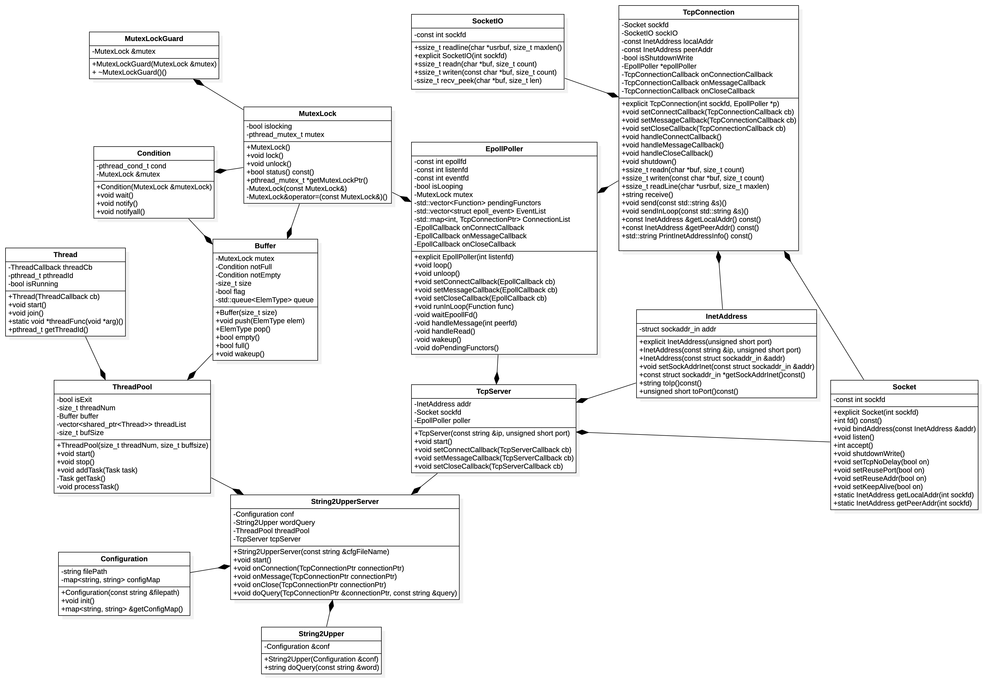

## Introduction
This project implements a server using Linux epoll and thread poll. The thread pool consists of a buffer and multithread mechanism. The buffer is a message queue, which applies producer-consumer model to process requests sent by clients. Mutex is used for multithread in order to avoid deadlock.

epoll provides a simple but high-efficient polling mechanism:
(1) epoll_create1 creates a epoll instance;
(2) epoll_ctl modifies the file descriptors in epoll instance;
(3) epoll_wait is used to wait I/O events.
## Usage
1. when you want architecture to support multiple clients at the same time.

### How to get it?
`git clone https://github.com/henrytien/threadpool_epoll.git`

### Building and run

If your system doesn't installed log4cpp, visit [Log for C++ Project](http://log4cpp.sourceforge.net/) and you can download and install.

- building the server
 ` cd threadpool_epoll` and `sh start.sh`
- building the client demo
 `cd client && make && sh client.sh`

## Design
Here are class diagram and sequence diagram.
- class diagram

- sequence diagram

## Examples
- start three clients

- clients

- work

- log

# Refrence
1. [cpprefrence](https://en.cppreference.com/w/cpp/utility)
2. [StarUML](https://docs.staruml.io/)
3. [GDB](https://thispointer.com//gdb-debugger-tutorial-series/)
4. [epoll](http://man7.org/linux/man-pages/man7/epoll.7.html)
5. [Class diagram](https://en.wikipedia.org/wiki/Class_diagram)
